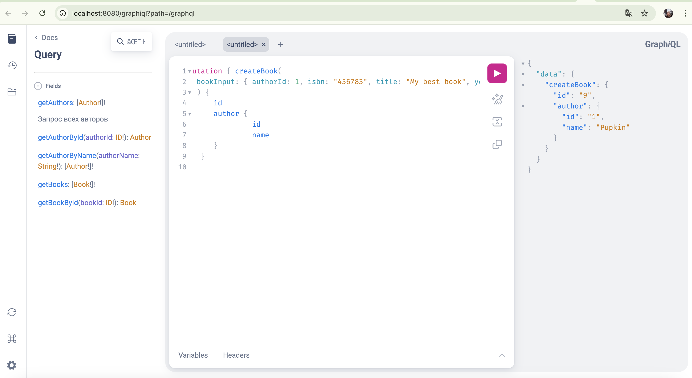

# Репозиторий для тренировки в документировании GraphQL API

Этот репозиторий предназначен для технических писателей, которые хотят получить опыт работы с GraphQL API и потренироваться в документировании такого API.

Вы сможете запустить на локальном компьютере приложение с GraphQL API, с которым можно взаимодействовать через графический интерфейс QraphiQL Playground или по HTTP (с помощью Postman, Curl и пр.).
В этом API также работает запрос интроспекции.



## Требования к компьютеру для развертывания и запуска приложения

Чтобы приложение запустилось на локальном компьютере, он должен соответствовать следующим требованиям:

- Наличие [`Java 21+`](https://www.oracle.com/java/technologies/downloads/#java21).
- Наличие [`Docker`](https://www.docker.com).

## Где документировать GraphQL API, чтобы увидеть результат при запуске приложения

Схема API находится в файле `author-book.graphqls` в папке `springboot-graphql-databases/author-book-api/src/main/resources/graphql`.
С ним вам и предстоит работать.
В файле уже есть есть несколько примеров комментариев, которые можно использовать как основу при документировании GraphQL API.
При написании комментариев используйте синтаксис [Commonmark](https://commonmark.org/help/).

## Как запустить приложение с GraphQL API

> Если у вас MacBook с `M`-процессором, перед запуском приложения в файле `springboot-graphql-databases/docker-compose.yml` раскомментируйте строки, содержащие `platform: linux/amd64` (строки 4 и 31).

Для запуска приложения выполните следующие действия:

1. Откройте терминал в корне этой папки и выполните команду:

  ```shell
  docker compose up -d
  ```

2. Убедитесь, что все контейнеры запущены. Для этого выполните команду:
  
  ```shell
  docker ps -a
  ```
  
    Вывод команды должен выглядеть примерно так:
  
  ```text
  CONTAINER ID   IMAGE                     COMMAND                      CREATED        STATUS                            PORTS                               NAMES

  397897ba0d2c   mongo:latest             "docker-entrypoint.s…"        1 day ago      Up 6 seconds (healthy)            0.0.0.0:27017->27017/tcp            mongodb
  741799bffa36   openzipkin/zipkin:3.4.1  "start-zipkin"                2 day ago      Up 6 seconds (healthy)            9410/tcp, 0.0.0.0:9411->9411/tcp    zipkin
  32f4deaccdd8   mysql:9.1.0              "docker-entrypoint.s…"        2 day ago      Up 6 seconds (healthy)            0.0.0.0:3306->3306/tcp, 33060/tcp   mysql
  ```

1. Выполните команду для сборки приложения:

  ```bash
  ./build-docker-images.sh
  ```

4. Запустите приложение:

  ```bash
  ./start-apps.sh
  ```

  После запуска приложения вы увидите в терминале сообщение с указанием адреса, на котором работает графиеский интерфейс QraphiQL Playground:

  ```text  
       Application   | URL Type |                                   URL |
     --------------- + -------- + ------------------------------------- |
   author-book-api | GraphiQL |        http://localhost:8080/graphiql |
  ```
  
## Как остановить приложение

Чтобы оставить приложение, выполните команду:

  ```bash
  ./stop-apps.sh
  ```

Чтобы остановить и удалить контейнеры приложения, выполните команду:
  
  ```bash
  docker compose down -v
  ```

> Репозиторий основан на форке [https://github.com/ivangfr/springboot-graphql-databases](https://github.com/ivangfr/springboot-graphql-databases).
